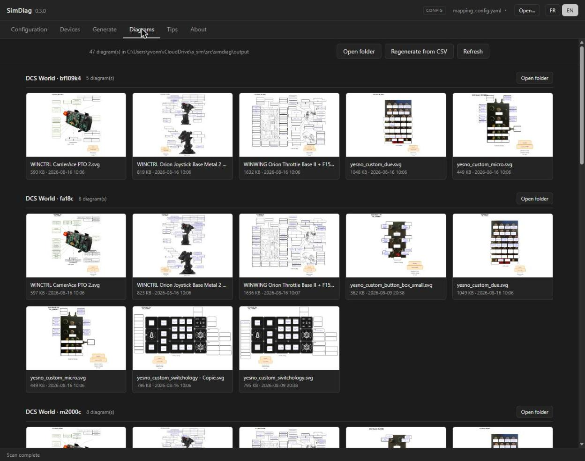
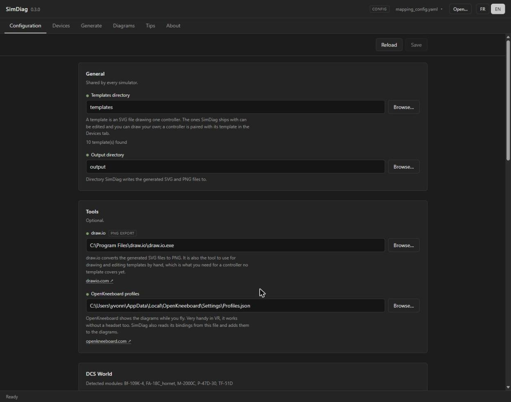
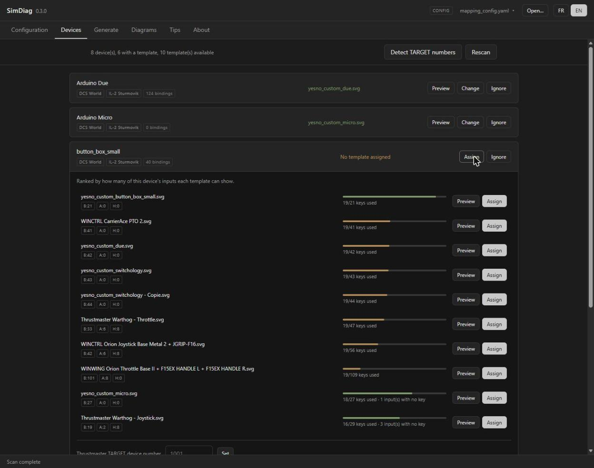

# SimDiag

SimDiag reads the controller configuration of your flight simulators (DCS World, IL-2 Sturmovik Great Battles, IL-2 Korea) and draws a diagram of every joystick, throttle and button box, with each control labelled by the action it triggers.



## Purpose

Experienced players memorize their bindings, but a visual reference card earns its place when:

- Starting with a new aircraft or simulator
- Returning to a simulation after an extended break
- Learning complex modifier combinations
- Sharing a configuration with another player

SimDiag displays all configured bindings at a glance. VR users can import the PNG exports into OpenKneeboard to read them in flight. The CSV export gives structured data for analysis or custom processing.

## Features

- **Multi-Simulator Support**: Parses DCS World, IL-2 Sturmovik Great Battles and IL-2 Korea controller bindings
- **Visual Diagrams**: Generates SVG diagrams with optional PNG conversion (via draw.io)
- **External Tool Integration**: Enriches bindings with Gremlins, TARGET, OpenKneeboard, and SimpleRadio Standalone (SRS) mappings
- **Modifier Support**: Displays modifier button combinations with color-coded visual grouping
- **CSV Export**: Exports bindings to CSV format for external analysis
- **Batch Mode**: Regenerates every diagram from the command line, without opening the interface

## Installation

Download the latest release from the [GitHub Releases](https://github.com/yesnault/simdiag/releases) page. The archive holds a single file, `simdiag.exe`.

No installation required - just run the executable. The templates of the common controllers are inside the binary: on first run the graphical interface offers to write them next to your configuration file, and the diagrams are then ordinary files you can open and edit.

## Getting Started

Run `simdiag.exe` with no argument. The interface opens on six tabs, and the first three are the whole setup:

**Configuration** - say where your simulators keep their files, and which optional tools you use alongside them. Each field explains what it is for, and validates as you type.



DCS World keeps its controller configuration in `Saved Games\DCS`. IL-2 wants the `data\input` directory of its installation. Aircraft modules are never declared: SimDiag detects them under the DCS path and exports all of them.

**Devices** - pair each controller with the SVG template that draws it. Templates are ranked by how many of that controller's actual bindings they can display. The one built for your hardware comes first:



**Generate** - run the export, on everything or on a single DCS module, and watch the log as it goes.

**Diagrams** then shows what came out, and opens the output folder. **Tips** covers running SimDiag from the command line, and **About** handles updates.

The configuration is written to `mapping_config.yaml` beside the executable. The command line reads that file but never writes it: everything above happens in the interface.

## Examples

### Output Examples

SimDiag generates visual diagrams that display controller bindings. Here's an example of a switchology panel exported from DCS World:


This example shows:
- **Color-coded modifier bindings**: Different colors indicate which modifier is active (e.g., green for BTN24, yellow for BTN152)
- **Multi-position switches**: Both positions and their assigned actions are displayed (e.g., "Bomb Qty Increase" / "Bomb Qty Decrease")
- **Function labels**: Each control displays its assigned action from the simulator configuration
- **Template-based layout**: Generated from SVG templates that can be customized for any controller

The same binding appears in several states depending on the modifier combination, and every available function fits on one reference card.

### TARGET Script Integration

SimDiag also processes TARGET script configurations, including layer switches (I, O, IO, M1, M2, M3, etc.):


This example demonstrates TARGET layer integration:
- **Layer detection**: SimDiag identifies TARGET layer switches and displays which layer is active
- **Virtual device mapping**: Physical inputs remapped through TARGET scripts are tracked and displayed
- **Layer indicators**: The active layer (in this case, layer I) is shown alongside the bindings
- **Cross-simulator support**: TARGET remapping works with DCS World, IL-2 Great Battles and IL-2 Korea configurations

SimDiag parses TARGET scripts to understand the complete input chain from physical device → TARGET layer/remapping → simulator binding. The keyboard layout is read from the profile itself. That is what makes an AZERTY author's keys match the simulator's bindings.

### Gremlins Integration

SimDiag processes Gremlins profile configurations, which use vJoy to remap physical inputs to virtual devices:


This example demonstrates Gremlins integration:
- **Shift mode tracking**: SimDiag identifies Gremlins shift modes (virtual layers) and displays which mode is active
- **vJoy mapping**: Physical device inputs remapped through Gremlins to vJoy devices are tracked and displayed
- **Virtual device identification**: The diagram shows both the physical input and its corresponding vJoy virtual device assignment
- **Cross-simulator support**: Gremlins remapping works with DCS World, IL-2 Great Battles and IL-2 Korea configurations

SimDiag parses Gremlins XML profile files to track the complete input chain from physical device → Gremlins shift mode/remapping → vJoy virtual device → simulator binding.

### OpenKneeboard Integration

SimDiag reads OpenKneeboard profile configurations and displays these bindings alongside simulator controls:


This example shows OpenKneeboard bindings integration:
- **OpenKneeboard bindings**: Buttons mapped to OpenKneeboard functions (Previous Tab, Next Tab, Toggle VR/AR, etc.) are displayed on the same diagram as simulator bindings
- **Profile detection**: SimDiag reads the OpenKneeboard `Profiles.json` file to extract input bindings
- **Unified view**: Both simulator bindings and OpenKneeboard controls appear on the same device diagram
- **Namespace identification**: OpenKneeboard bindings are prefixed with "OpenKneeboard:" to distinguish them from simulator controls

This allows you to see all functions assigned to your physical controllers in a single reference card, regardless of whether they control the simulator or external tools.

### SimpleRadio Standalone (SRS) Integration

SimDiag parses SRS configuration files and displays radio bindings on your controller diagrams:


This example shows SRS bindings integration:
- **SRS bindings**: Push-to-talk, radio channel switching, and other SRS controls are displayed on the device diagram
- **Configuration parsing**: SimDiag reads SRS input configuration files from the SRS installation directory
- **Combined view**: SRS bindings appear alongside simulator bindings on the same controller
- **Prefix identification**: SRS bindings are prefixed with "SRS" to distinguish them from simulator controls

SimDiag supports both DCS-SimpleRadio-Standalone and IL2-SimpleRadio-Standalone configurations.

## Command Line

Once the configuration exists, SimDiag regenerates every diagram without opening the interface. The command line exports; it never writes the configuration.

```bash
./simdiag.exe [options]
```

Run it from the directory holding your configuration file: paths inside the file are relative to it. The Tips tab writes a `run_simdiag_batch.bat` that takes care of this: double-click it and everything regenerates.

### Command-Line Options

- *(no option)* - Opens the graphical interface, on the configuration last used
- `-b` - Batch mode: export everything the configuration declares
- `-c FILE` - Configuration file path (default: `mapping_config.yaml`). On its own, opens the interface on that file
- `-csv FILE` - Generate SVG/PNG from an existing CSV file
- `-f FILTER` - Filter modules in batch mode (e.g., `"2000"` for M-2000C, `"il-2"` for IL-2)
- `--no-svg` - Export CSV only, skip SVG generation
- `-v` - Display version information
- `update` - Download and install the latest release

### Examples

**Export everything**:
```bash
./simdiag.exe -b
```

**Export a single module**:
```bash
./simdiag.exe -b -f 2000
```

**CSV export only** (skip SVG generation):
```bash
./simdiag.exe -b --no-svg
```

**Generate SVG from an existing CSV**:
```bash
./simdiag.exe -csv output/export.csv
```

**Use another configuration file**:
```bash
./simdiag.exe -c my_custom_config.yaml -b
```

## Configuration File

The Configuration tab writes `mapping_config.yaml`; this section describes what ends up in it, for anyone who wants to read or version their own.

- **Global settings**: Templates directory, output directory, device-to-template mappings
- **DCS World**: Installation path, Gremlins/TARGET profiles. Aircraft modules are not listed: they are detected from the installation path and all of them are exported.
- **IL-2 Sturmovik Great Battles**: Input path, Gremlins/TARGET profiles
- **IL-2 Korea**: Input path, Gremlins/TARGET profiles
- **SimpleRadio (SRS)**: Two global paths, `dcs_srs_path` and `il2_srs_path`. DCS-SRS and IL2-SRS are separate installations, while both IL-2 titles use the same one.
- **OpenKneeboard**: Profile path for additional bindings

### Example Configuration

```yaml
templates_directory: ./templates
output_directory: ./output

device_mappings:
  - device_guid: EE6F1C30-3F2E-11f0-8001-444553540000
    device_name: WINWING Orion Joystick
    template_filepath: base\winwing-orion-stick.svg
  - device_guid: 530648C0-98C7-11f0-8002-444553540000
    device_name: WINWING Orion Throttle Base II
    template_filepath: base\winwing-orion-throttle.svg
  - device_guid: B0C891C0-3F30-11f0-8003-444553540000
    device_name: T-Rudder
    template_filepath: ""
    skip_template: true

simulators:
  dcs_world:
    dcs_path: C:\Users\YourName\Saved Games\DCS
    gremlins_profile_filepath: C:\Path\To\Gremlins\profile.xml

  il2_sturmovik:
    il2_input_path: C:\Program Files\IL-2 Sturmovik Great Battles\data\input
    gremlins_profile_filepath: C:\Path\To\Gremlins\profile.xml

  il2_korea:
    il2_input_path: C:\Program Files\IL2Series\game\data\Input
    gremlins_profile_filepath: C:\Path\To\Gremlins\profile.xml

openkneeboard_profiles_filepath: C:\Users\YourName\AppData\Local\OpenKneeboard\Settings\Profiles.json

# One SimpleRadio installation per game family: both IL-2 titles share IL2-SRS.
dcs_srs_path: C:\Program Files\DCS-SimpleRadio-Standalone
il2_srs_path: C:\Program Files\IL2-SimpleRadio-Standalone
```

## Templates

SimDiag ships the SVG templates of the common controllers (WINWING, Thrustmaster) inside the binary. When the templates directory does not have them, the Configuration tab offers to install them. **A file already on disk is never overwritten**, so a template you have edited stays yours. You can of course create or modify templates to match your own hardware.

### Creating Custom Templates

**It is strongly recommended to use [draw.io](https://www.drawio.com/) (diagrams.net) for creating templates.** Install the base templates from the Configuration tab first, then **examine them** to understand the structure, placeholder naming conventions, and layout best practices.

Templates are SVG files with placeholder text that gets replaced with binding information. To create a custom template:

1. **Review existing templates** - Open the installed templates in draw.io to see how they're structured
2. **Use draw.io** to create your controller diagram:
   - Draw your controller layout (buttons, axes, switches, etc.)
   - Add text boxes for each control you want to display bindings for
3. **Add text placeholders** for buttons, axes, and POV hats:
   - Buttons: `Button_1`, `Button_2`, ..., `Button_32`
   - Axes: `AXIS_X`, `AXIS_Y`, `AXIS_Z`, `AXIS_RX`, `AXIS_RY`, `AXIS_RZ`, `AXIS_SLIDER`
   - POV hats: `POV_1_U`, `POV_1_D`, `POV_1_L`, `POV_1_R`
   - Modifier slots: `Button_N_Modifier_M` (N = button number, M = 1-10 for color-coded modifiers)
4. **Export as SVG** from draw.io (File → Export as → SVG)
5. **Save to** the templates directory (or a subdirectory like `templates/base/`)
6. **Open the Devices tab** and assign the template to your controller

**Tip**: The existing templates demonstrate proper spacing, text sizing, and layout organization. Use them as a reference to ensure your custom templates work correctly with SimDiag's replacement engine.

## Output Structure

SimDiag generates the following output structure:

```
output/
├── export.csv                  # Unified CSV export of all bindings
├── dcs-m2000c/                 # DCS M-2000C module diagrams
│   ├── warthog-stick.svg
│   ├── ...
│   └── png/                    # PNG exports, when draw.io is configured
│       └── warthog-stick.png
├── dcs-fa18c_hornet/           # DCS FA-18C module diagrams
│   └── ...
├── il2/                        # IL-2 Sturmovik Great Battles diagrams
│   └── ...
└── il2-korea/                  # IL-2 Korea diagrams
    └── ...
```

The Diagrams tab shows the PNG whenever one exists: the generated SVG carries its labels in a form only draw.io re-parses, so a browser would show the markup rather than the text.

### CSV Format

The CSV export contains 13 columns:

- `Simulator` - Simulator config key (dcs_world, il2_sturmovik, il2_korea)
- `Module` - Module/aircraft name (M-2000C, FA-18C, etc.)
- `Action` - Binding description
- `Modifier` - Modifier state (e.g., "Modifier BTN24")
- `Modifier Device` - Device providing the modifier
- `Modifier Num` - Modifier number for color coding
- `Physical Device` - Original device name
- `Physical Input` - Original input (BTN1, AXIS_X, POV_1_U, etc.)
- `Physical Device GUID` - Device GUID
- `Virtual Device` - Remapped device name (from Gremlins/TARGET)
- `Virtual Input` - Remapped input
- `Template Key` - SVG template key (Button_1, AXIS_X, etc.)
- `Template` - Template filename

## Reporting Issues

Submit issues at: https://github.com/yesnault/simdiag/issues

The CSV is the intermediate every diagram is drawn from. Where a binding goes wrong tells you what to attach.

### Bug Visible in CSV Export

Run `./simdiag.exe -b --no-svg` and attach:
- The generated `export.csv`
- Your `mapping_config.yaml`
- The simulator configuration files for the affected module
- Any external tool configuration involved (Gremlins profile, TARGET script, OpenKneeboard profile, SRS settings)

### Bug in SVG/PNG Export Only

If the binding is correct in the CSV but wrong on the diagram, attach:
- The generated `export.csv`
- The SVG or PNG showing the problem
- The template file used, if it is a custom one

This isolates the issue to the SVG generation stage.

## License

Copyright 2026 Yvonnick Esnault

Licensed under the Apache License, Version 2.0 (the "License");
you may not use this file except in compliance with the License.
You may obtain a copy of the License at

    http://www.apache.org/licenses/LICENSE-2.0

Unless required by applicable law or agreed to in writing, software
distributed under the License is distributed on an "AS IS" BASIS,
WITHOUT WARRANTIES OR CONDITIONS OF ANY KIND, either express or implied.
See the License for the specific language governing permissions and
limitations under the License.
