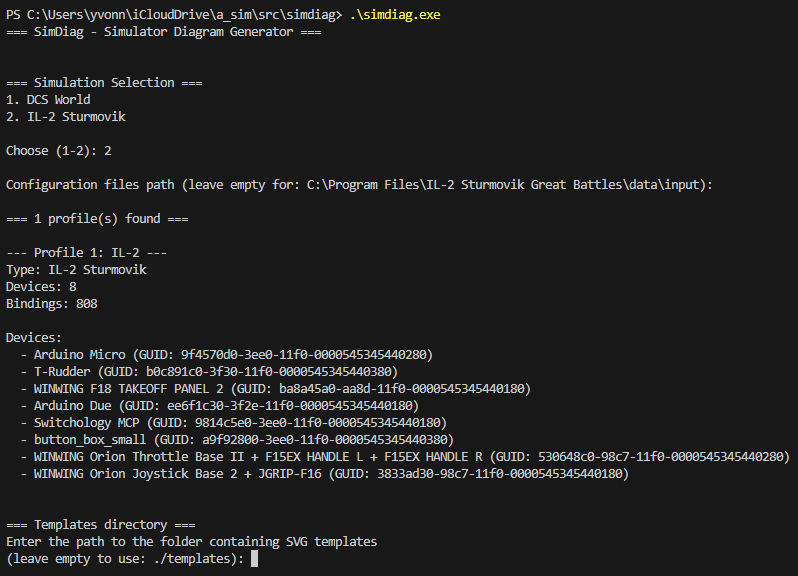
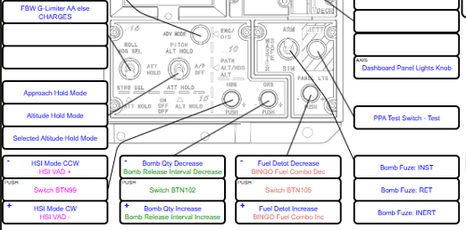
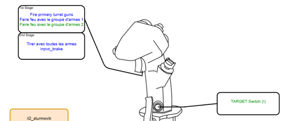
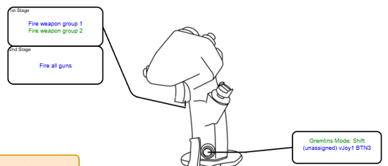
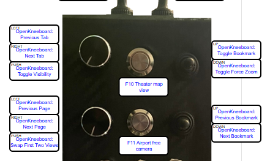
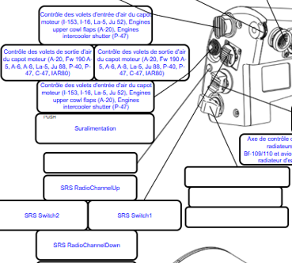

# SimDiag

SimDiag is a Windows CLI tool that parses flight simulator controller configurations (DCS World, IL-2 Sturmovik Great Battles, IL-2 Korea) and generates visual SVG/PNG diagrams showing joystick and throttle button assignments.

## Purpose

While experienced players typically memorize their button assignments, visual reference cards become valuable when:
- Starting with a new aircraft or simulator
- Returning to a simulation after an extended break
- Learning complex modifier combinations
- Sharing a configuration with another player

SimDiag generates visual diagrams that display all configured bindings at a glance. VR users can import the PNG exports into OpenKneeboard to view these bindings in-game. The CSV export format provides advanced users with structured data for analysis or custom processing.

### Relation to Joystick Diagrams

SimDiag is inspired by [joystick-diagrams.com](https://joystick-diagrams.com/), with some differences:

**SimDiag-specific features:**
- OpenKneeboard profile integration
- IL-2 Sturmovik Great Battles and IL-2 Korea support
- SimpleRadio Standalone integration (both DCS and IL-2 versions)
- Simplified template syntax (no `_modifier` suffix required in templates)

**SimDiag limitation:**
- Command-line interface only (no GUI)

If you need a graphical interface and don't require OpenKneeboard or SRS integration, [joystick-diagrams.com](https://joystick-diagrams.com/) may be more suitable.

## Features

- **Multi-Simulator Support**: Parses DCS World, IL-2 Sturmovik Great Battles and IL-2 Korea controller bindings
- **Visual Diagrams**: Generates SVG diagrams with optional PNG conversion (via draw.io)
- **External Tool Integration**: Enriches bindings with Gremlins, TARGET, OpenKneeboard, and SimpleRadio Standalone (SRS) mappings
- **Modifier Support**: Displays modifier button combinations with color-coded visual grouping
- **CSV Export**: Exports bindings to CSV format for external analysis
- **Batch Mode**: Non-interactive processing for CI/CD workflows

## Examples

### Command-Line Interface

SimDiag operates through a command-line interface:



The interactive mode guides you through configuration setup, simulator selection, and device detection. For automation, use batch mode with `./simdiag.exe -b` to automatically export diagrams without prompts (requires existing configuration file).

### Output Examples

SimDiag generates visual diagrams that display controller bindings. Here's an example of a switchology panel exported from DCS World:



This example shows:
- **Color-coded modifier bindings**: Different colors indicate which modifier is active (e.g., green for BTN24, yellow for BTN152)
- **Multi-position switches**: Both positions and their assigned actions are displayed (e.g., "Bomb Qty Increase" / "Bomb Qty Decrease")
- **Function labels**: Each control displays its assigned action from the simulator configuration
- **Template-based layout**: Generated from SVG templates that can be customized for any controller

The same binding can appear in multiple states depending on modifier combinations, allowing all available functions to be displayed on a single reference card.

### TARGET Script Integration

SimDiag also processes TARGET script configurations, including layer switches (I, O, IO, M1, M2, M3, etc.):



This example demonstrates TARGET layer integration:
- **Layer detection**: SimDiag identifies TARGET layer switches and displays which layer is active
- **Virtual device mapping**: Physical inputs remapped through TARGET scripts are tracked and displayed
- **Layer indicators**: The active layer (in this case, layer I) is shown alongside the bindings
- **Cross-simulator support**: TARGET remapping works with DCS World, IL-2 Great Battles and IL-2 Korea configurations

SimDiag parses TARGET scripts to understand the complete input chain from physical device → TARGET layer/remapping → simulator binding.

### Gremlins Integration

SimDiag processes Gremlins profile configurations, which use vJoy to remap physical inputs to virtual devices:



This example demonstrates Gremlins integration:
- **Shift mode tracking**: SimDiag identifies Gremlins shift modes (virtual layers) and displays which mode is active
- **vJoy mapping**: Physical device inputs remapped through Gremlins to vJoy devices are tracked and displayed
- **Virtual device identification**: The diagram shows both the physical input and its corresponding vJoy virtual device assignment
- **Cross-simulator support**: Gremlins remapping works with DCS World, IL-2 Great Battles and IL-2 Korea configurations

SimDiag parses Gremlins XML profile files to track the complete input chain from physical device → Gremlins shift mode/remapping → vJoy virtual device → simulator binding.

### OpenKneeboard Integration

SimDiag reads OpenKneeboard profile configurations and displays these bindings alongside simulator controls:



This example shows OpenKneeboard bindings integration:
- **OpenKneeboard bindings**: Buttons mapped to OpenKneeboard functions (Previous Tab, Next Tab, Toggle VR/AR, etc.) are displayed on the same diagram as simulator bindings
- **Profile detection**: SimDiag reads the OpenKneeboard `Profiles.json` file to extract input bindings
- **Unified view**: Both simulator bindings and OpenKneeboard controls appear on the same device diagram
- **Namespace identification**: OpenKneeboard bindings are prefixed with "OpenKneeboard:" to distinguish them from simulator controls

This allows you to see all functions assigned to your physical controllers in a single reference card, regardless of whether they control the simulator or external tools.

### SimpleRadio Standalone (SRS) Integration

SimDiag parses SRS configuration files and displays radio bindings on your controller diagrams:



This example shows SRS bindings integration:
- **SRS bindings**: Push-to-talk, radio channel switching, and other SRS controls are displayed on the device diagram
- **Configuration parsing**: SimDiag reads SRS input configuration files from the SRS installation directory
- **Combined view**: SRS bindings appear alongside simulator bindings on the same controller
- **Prefix identification**: SRS bindings are prefixed with "SRS" to distinguish them from simulator controls

SimDiag supports both DCS-SimpleRadio-Standalone and IL2-SimpleRadio-Standalone configurations.

## Installation

Download the latest `simdiag.exe` from the [GitHub Releases](https://github.com/yesnault/simdiag/releases) page.

No installation required - just run the executable.

### Updating

To update to the latest version:

```bash
./simdiag.exe update
```

This command:
- Downloads the latest release from GitHub
- Updates the executable in place
- Updates templates with interactive conflict resolution (prompts before overwriting local modifications)

## Configuration

SimDiag uses a YAML configuration file (`mapping_config.yaml` by default). **You don't need to create this file manually** - simply run `./simdiag.exe` in interactive mode and it will guide you through the configuration process.

The configuration includes:

- **Global settings**: Templates directory, output directory, device-to-template mappings
- **DCS World**: Installation path, modules to export, Gremlins/SRS paths
- **IL-2 Sturmovik Great Battles**: Input path, Gremlins/SRS paths
- **IL-2 Korea**: Input path, Gremlins/SRS paths
- **OpenKneeboard**: Profile path for additional bindings

### Example Configuration

```yaml
templates_directory: ./templates
output_directory: ./output

device_mappings:
  - device_guid: EE6F1C30-3F2E-11f0-8001-444553540000
    device_name: WINWING Orion Joystick
    template_filepath: base\winwing-orion-stick.svg
  - device_guid: 530648C0-98C7-11f0-8002-444553540000
    device_name: WINWING Orion Throttle Base II
    template_filepath: base\winwing-orion-throttle.svg
  - device_guid: B0C891C0-3F30-11f0-8003-444553540000
    device_name: T-Rudder
    template_filepath: ""
    skip_template: true

simulators:
  dcs_world:
    dcs_path: C:\Users\YourName\Saved Games\DCS
    srs_path: C:\Program Files\DCS-SimpleRadio-Standalone
    modules:
      fa18c:
        gremlins_profile_filepath: C:\Path\To\Gremlins\profile.xml
      m2000c:
        gremlins_profile_filepath: C:\Path\To\Gremlins\profile.xml

  il2_sturmovik:
    il2_input_path: C:\Program Files\IL-2 Sturmovik Great Battles\data\input
    srs_path: C:\Program Files\IL2-SimpleRadio-Standalone
    gremlins_profile_filepath: C:\Path\To\Gremlins\profile.xml

  il2_korea:
    il2_input_path: C:\Program Files\IL2Series\game\data\Input
    srs_path: C:\Program Files\IL2-SimpleRadio-Standalone
    gremlins_profile_filepath: C:\Path\To\Gremlins\profile.xml

openkneeboard_profiles_filepath: C:\Users\YourName\AppData\Local\OpenKneeboard\Settings\Profiles.json
```

## Templates

SimDiag includes a few built-in SVG templates for common controllers (WINWING, Thrustmaster, etc.). However, you can create or modify templates to match your specific hardware.

### Creating Custom Templates

**It is strongly recommended to use [draw.io](https://www.drawio.com/) (diagrams.net) for creating templates.** Before creating your own template, **examine the existing templates** in the `templates/` directory to understand the structure, placeholder naming conventions, and layout best practices.

Templates are SVG files with placeholder text that gets replaced with binding information. To create a custom template:

1. **Review existing templates** - Open templates from the `templates/` directory in draw.io to see how they're structured
2. **Use draw.io** to create your controller diagram:
   - Draw your controller layout (buttons, axes, switches, etc.)
   - Add text boxes for each control you want to display bindings for
3. **Add text placeholders** for buttons, axes, and POV hats:
   - Buttons: `Button_1`, `Button_2`, ..., `Button_32`
   - Axes: `AXIS_X`, `AXIS_Y`, `AXIS_Z`, `AXIS_RX`, `AXIS_RY`, `AXIS_RZ`, `AXIS_SLIDER`
   - POV hats: `POV_1_U`, `POV_1_D`, `POV_1_L`, `POV_1_R`
   - Modifier slots: `Button_N_Modifier_M` (N = button number, M = 1-10 for color-coded modifiers)
4. **Export as SVG** from draw.io (File → Export as → SVG)
5. **Save to** `templates/` directory (or subdirectory like `templates/base/`)
6. **Run `./simdiag.exe`** in interactive mode to associate the template with your device

**Tip**: The existing templates demonstrate proper spacing, text sizing, and layout organization. Use them as a reference to ensure your custom templates work correctly with SimDiag's replacement engine.

## Usage

```bash
./simdiag.exe [options]
```

### Command-Line Options

- `-b` - Batch mode (non-interactive, requires existing configuration)
- `-v` - Display version information
- `-c FILE` - Specify configuration file path (default: `mapping_config.yaml`)
- `-csv FILE` - Generate SVG/PNG from existing CSV file
- `-f FILTER` - Filter modules in batch mode (e.g., `"2000"` for M-2000C, `"il2"` for IL-2)
- `--no-svg` - Export CSV only, skip SVG generation

### Examples

**Update to latest version**:
```bash
./simdiag.exe update
```

**Interactive mode** (prompts for configuration):
```bash
./simdiag.exe
```

**Batch mode** (use existing configuration):
```bash
./simdiag.exe -b
```

**Batch mode with filter** (export only M-2000C module):
```bash
./simdiag.exe -b -f 2000
```

**CSV export only** (skip SVG generation):
```bash
./simdiag.exe -b --no-svg
```

**Generate SVG from existing CSV**:
```bash
./simdiag.exe -csv output/export.csv
```

**Custom configuration file**:
```bash
./simdiag.exe -c my_custom_config.yaml -b
```

## Output Structure

SimDiag generates the following output structure:

```
output/
├── export.csv                  # Unified CSV export of all bindings
├── dcs-m2000c/                 # DCS M-2000C module diagrams
│   ├── warthog-stick.svg
│   ├── warthog-stick.png
│   └── ...
├── dcs-fa18c_hornet/           # DCS FA-18C module diagrams
│   └── ...
├── il2/                        # IL-2 Sturmovik Great Battles diagrams
│   └── ...
└── il2-korea/                  # IL-2 Korea diagrams
    └── ...
```

### CSV Format

The CSV export contains 13 columns:

- `Simulator` - Simulator config key (dcs_world, il2_sturmovik, il2_korea)
- `Module` - Module/aircraft name (M-2000C, FA-18C, etc.)
- `Action` - Binding description
- `Modifier` - Modifier state (e.g., "Modifier BTN24")
- `Modifier Device` - Device providing the modifier
- `Modifier Num` - Modifier number for color coding
- `Physical Device` - Original device name
- `Physical Input` - Original input (BTN1, AXIS_X, POV_1_U, etc.)
- `Physical Device GUID` - Device GUID
- `Virtual Device` - Remapped device name (from Gremlins/TARGET)
- `Virtual Input` - Remapped input
- `Template Key` - SVG template key (Button_1, AXIS_X, etc.)
- `Template` - Template filename

## Development

### Prerequisites

- Go 1.25 or later
- [GoReleaser](https://goreleaser.com/) (automatically installed by build scripts)
- [golangci-lint](https://golangci-lint.run/) (for linting)

### Building from Source

```bash
make build
```

The build process:
1. Runs `golangci-lint` to check code quality
2. Uses GoReleaser to build with version information
3. Copies the binary to the project root

### Testing

**Run all tests**:
```bash
make test
```

**Unit tests only**:
```bash
make unit-test
```

**Integration tests only**:
```bash
make integration-test
```

**Update expected CSV after intentional changes**:
```bash
make update-expected
```

### Cleaning Build Artifacts

```bash
make clean
```

### Project Structure

```
simdiag/
├── cmd/simdiag/        # Main entry point
├── common/             # Shared types, config, utilities
├── dcs/                # DCS World parser
├── il2/                # IL-2 Sturmovik Great Battles parser
├── il2korea/           # IL-2 Korea parser
├── gremlins/           # Gremlins binding enricher
├── target/             # TARGET binding enricher
├── openkneeboard/      # OpenKneeboard binding enricher
├── srs/                # SimpleRadio Standalone enricher
├── csv/                # CSV export logic
├── svg/                # SVG template processing
├── workflow/           # Pipeline orchestration
├── templates/          # SVG device templates
└── tests/              # Integration tests
```

## Reporting Issues

When reporting a bug, the required files depend on where the issue occurs:

### Bug Visible in CSV Export

If the bug appears in the generated CSV file (incorrect bindings, missing entries, wrong device mapping, etc.), provide:
- All simulator configuration files needed to reproduce the issue
- Your `mapping_config.yaml` configuration file
- Any external tool configurations (Gremlins profiles, TARGET scripts, OpenKneeboard profiles, SRS settings)

This allows reproduction of the parsing and enrichment pipeline.

### Bug in SVG/PNG Export Only

If the CSV file is correct but the SVG or PNG output is incorrect (wrong layout, missing buttons, incorrect text replacement, etc.), provide:
- The CSV file that was used as input
- The generated PNG file showing the issue
- The template file used (if custom)

This isolates the issue to the SVG generation stage.

Submit issues at: https://github.com/yesnault/simdiag/issues

## License

Copyright 2026 Yvonnick Esnault

Licensed under the Apache License, Version 2.0 (the "License");
you may not use this file except in compliance with the License.
You may obtain a copy of the License at

    http://www.apache.org/licenses/LICENSE-2.0

Unless required by applicable law or agreed to in writing, software
distributed under the License is distributed on an "AS IS" BASIS,
WITHOUT WARRANTIES OR CONDITIONS OF ANY KIND, either express or implied.
See the License for the specific language governing permissions and
limitations under the License.
